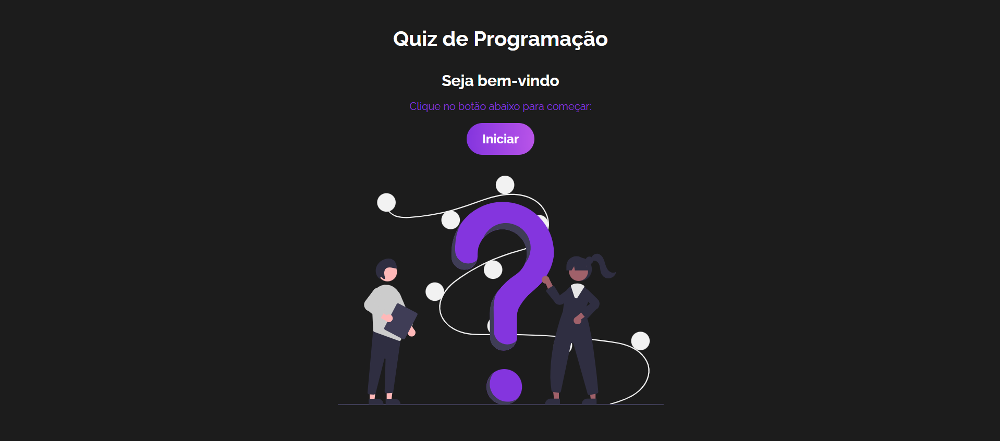
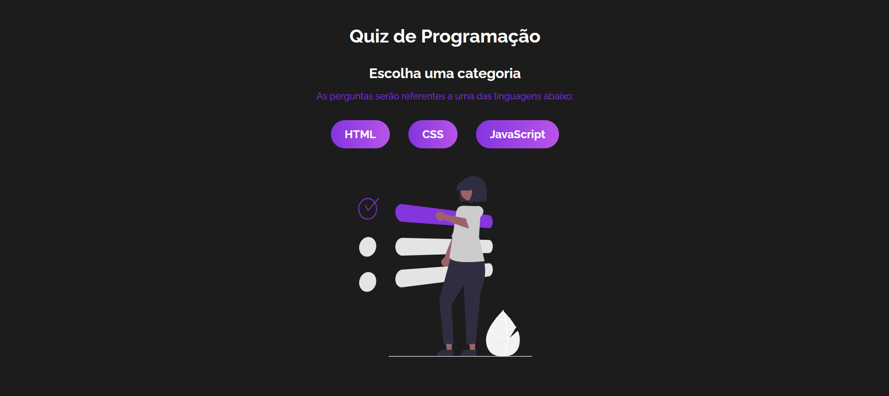
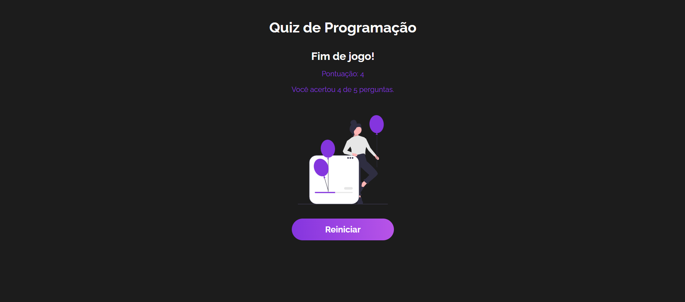

# **Quiz de Programação**

## 📚 **Descrição**
Um quiz interativo e dinâmico sobre programação, desenvolvido em React. O projeto permite escolher categorias, responder perguntas aleatórias e acompanhar a pontuação ao final do jogo. Inclui funcionalidades como dicas e exclusão de opções para auxiliar nas respostas.

---

## 🎯 **Funcionalidades**
- **Escolha de Categorias:** Selecione uma categoria para iniciar o quiz.  
- **Reordenação de Perguntas:** Perguntas embaralhadas para tornar o jogo mais desafiador.  
- **Dicas e Ajuda:** Receba dicas ou remova opções incorretas para facilitar sua decisão.  
- **Pontuação Dinâmica:** Veja sua pontuação ser atualizada em tempo real após cada resposta.  
- **Fluxo de Jogo Intuitivo:** Ciclo completo com telas de início, escolha de categoria, perguntas e finalização.  

---

## 🛠️ **Tecnologias Utilizadas**
- **React:** Biblioteca principal para construção da interface.  
- **Context API e useReducer:** Gerenciamento de estado global e manipulação de ações.  
- **CSS:** Estilização de componentes com arquivos separados por funcionalidade.  

---

## 🚀 **Como Rodar o Projeto**

1. Clone este repositório:
   ```bash
   git clone <url-do-repositorio>
   ```
2. Acesse o diretório do projeto:
   ```bash
   cd quiz
   ```
3. Instale as dependências:
   ```bash
   npm install
   ```
4. Inicie o projeto:
   ```bash
   npm start
   ```
5. Abra o navegador e acesse:
   ```
   http://localhost:3000
   ```

---

## 🖼️ **Capturas de Tela**
Abaixo estão algumas imagens do projeto em funcionamento:

### 1. Tela de Boas-Vindas


### 2. Escolha de Categorias


### 3. Pergunta Atual


### 4. Tela de Pontuação Final


---

## 📁 **Estrutura do Projeto**
```
quiz/
├── public/
│   ├── prints/                # Imagens das telas
│   └── index.html             # HTML principal
├── src/
│   ├── components/            # Componentes reutilizáveis
│   │   ├── Welcome.js         # Tela inicial
│   │   ├── PickCategory.js    # Escolha de categoria
│   │   ├── Question.js        # Perguntas e opções
│   │   └── GameOver.js        # Tela de finalização
│   ├── Context/               # Contexto do quiz
│   │   └── quiz.js            # Gerenciamento de estado global
│   ├── data/                  # Banco de perguntas
│   ├── imgsapp/               # Imagens utilizadas no app
│   ├── App.css                # Estilos globais
│   ├── App.js                 # Arquivo principal do React
│   └── index.js               # Renderização do React
├── package.json               # Configurações do projeto
└── README.md                  # Documentação
```

---

## 🌟 **Destaques do Código**
### Contexto Global do Quiz (quiz.js)
Utiliza `useReducer` para gerenciar o estado e as ações:
```javascript
const initialState = {
  gameStage: "Start",
  questions,
  currentQuestion: 0,
  answerSelected: false,
  score: 0,
  help: false,
  optionToHide: null,
};

const quizReducer = (state, action) => {
  switch (action.type) {
    case "CHANGE_STAGE":
      return { ...state, gameStage: "Category" };
    case "START_GAME":
      return {
        ...state,
        questions: action.payload,
        gameStage: "Playing",
      };
    default:
      return state;
  }
};
```

### Componentização com Props
O componente `Option` exibe as opções de resposta dinamicamente:  
```javascript
const Option = ({ option, selectOption, answer, hide }) => {
  return (
    <div
      onClick={selectOption}
      className={`option ${hide ? "hide" : ""}`}
    >
      <p>{option}</p>
    </div>
  );
};

---
